# React Admin Dashboard

React Admin Dashboard is a COMPLETE web application designed to help teams manage their projects efficiently. It provides features for tracking project progress, managing tasks, and collaborating with team members. It was built using React, Material UI, Data Grid, Light & Dark Mode, formik, Bar Chart, Pie Chart, Line Chart, Geography Chart, and more.

## Technologies Used

HTML | CSS | JavaScript | React | React Router | React Pro Sidebar | Material UI | Data Grid | formik | full calendar | yup validation | nivo charts (Bar Chart, Pie Chart, Line Chart, Geography Chart)

## Features

### Dashboard:

- Get an overview of all projects and tasks in one place.
- **Project Management**: Create, edit, and manage multiple projects.
- Users can switch the page between Light Mode and Dark Mode.
- The sidebar can be collapsed as needed.

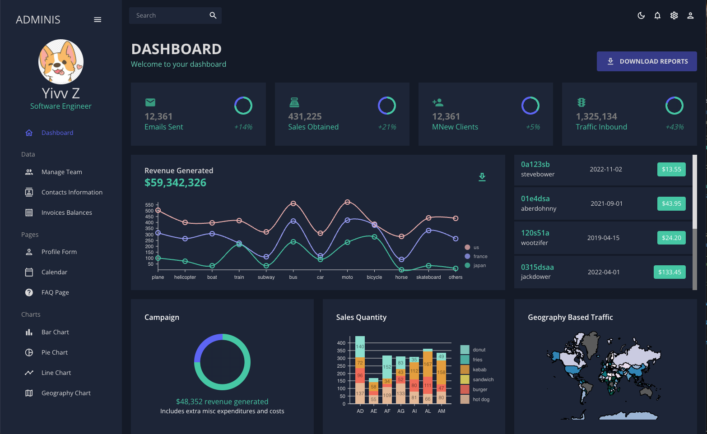

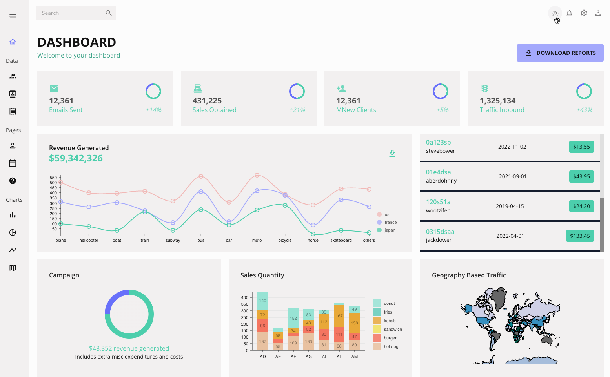

### Team Page

### Contact Page

### Invoice Page

- Users can sort each column on each page by ascending order or by descending order.
- Users can hide the column(s).
- Users can filter the contents for each column.
- Users can manage the columns on each page.
- Users can select the cost row on Invoice page.

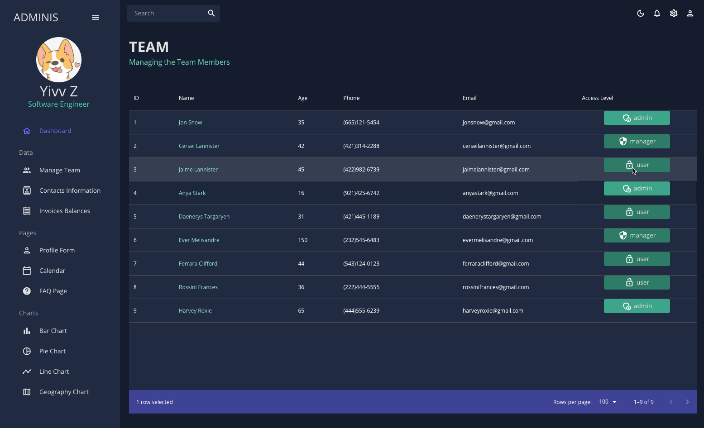

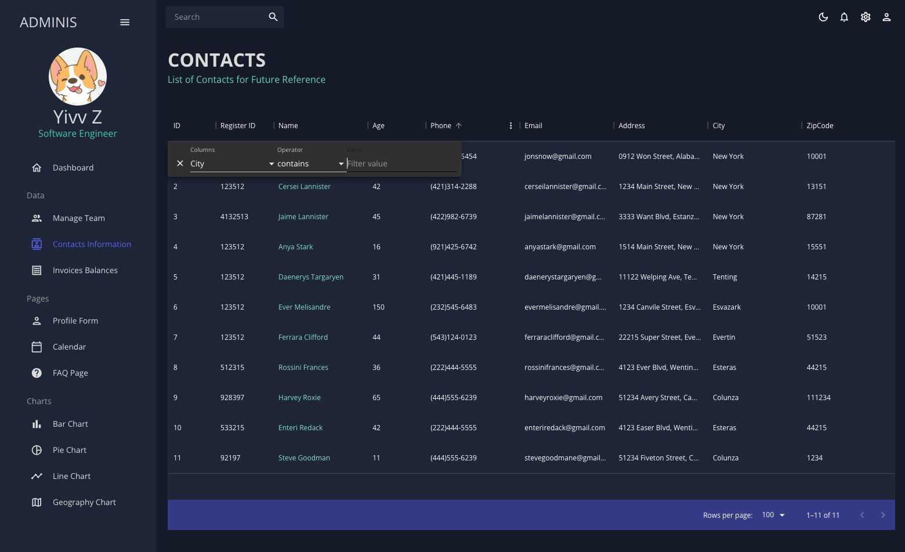

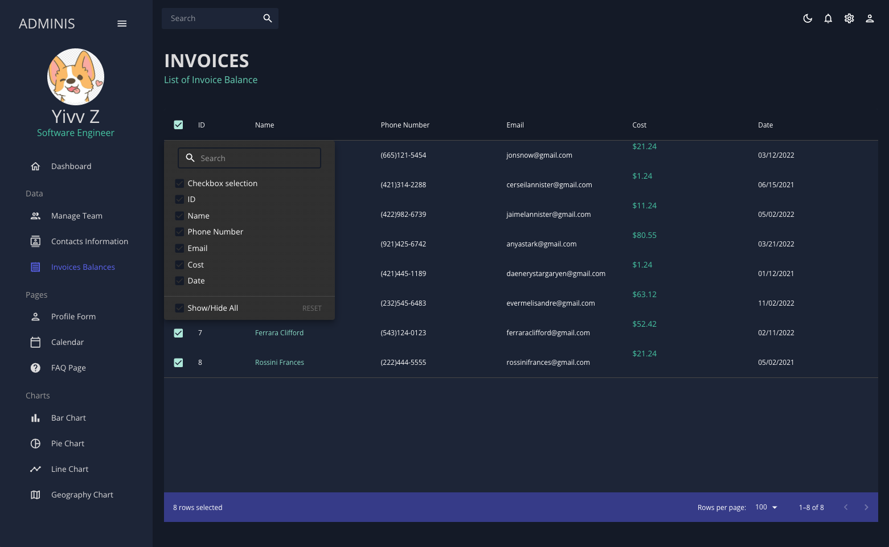

### Profile Form:

- Users can create a new user profile.

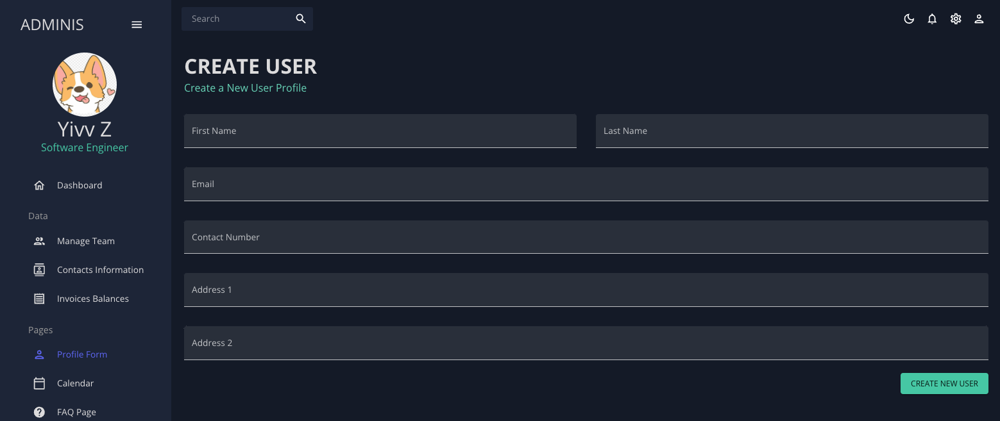

### Calendar Page:

- **Monthly View, Weekly View, Daily View, List View**: Use the navigation buttons to switch and display tasks and milestones in a monthly, weekly, or daily calendar format, or list format.
- **Daily View**: Focus on tasks and milestones for a specific day with time setting.
- **Interactive**: Click on a date or a time slot to **add** a new task or milestone for that day; click on a task to **delete** that task.
- **Calendar Library**: FullCalendar or similar library for calendar functionalities.

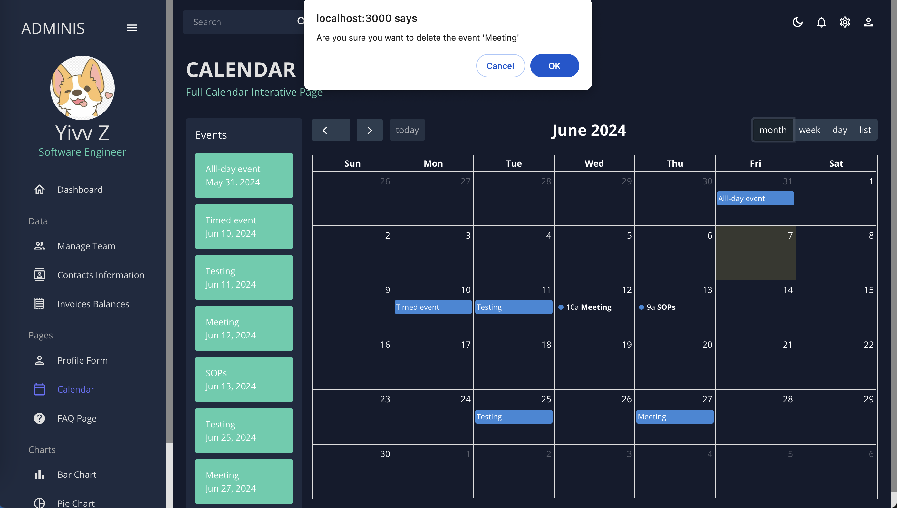

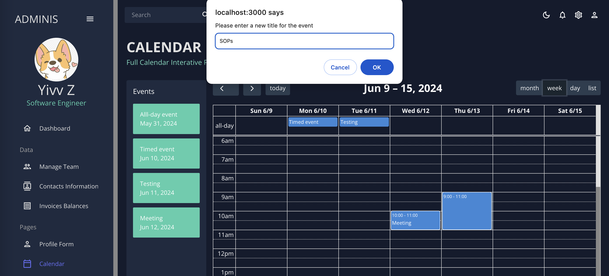

### FAQ Page:

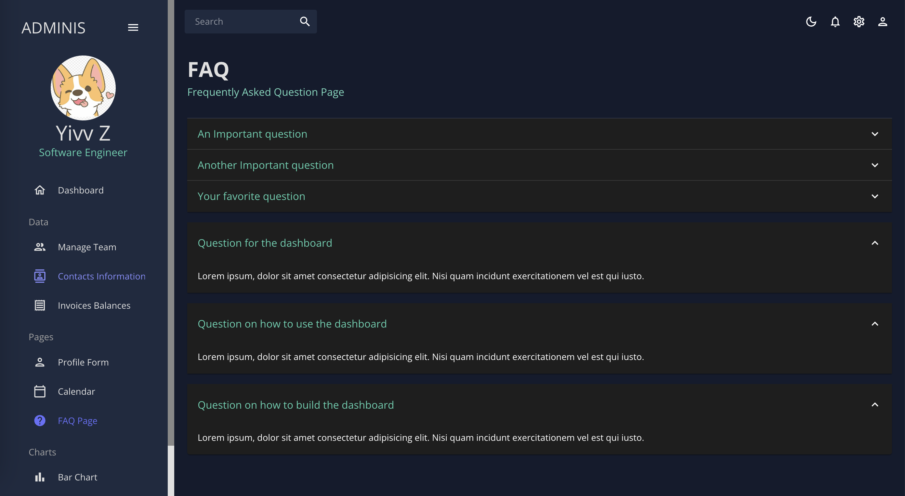

### Bar Chart Page:

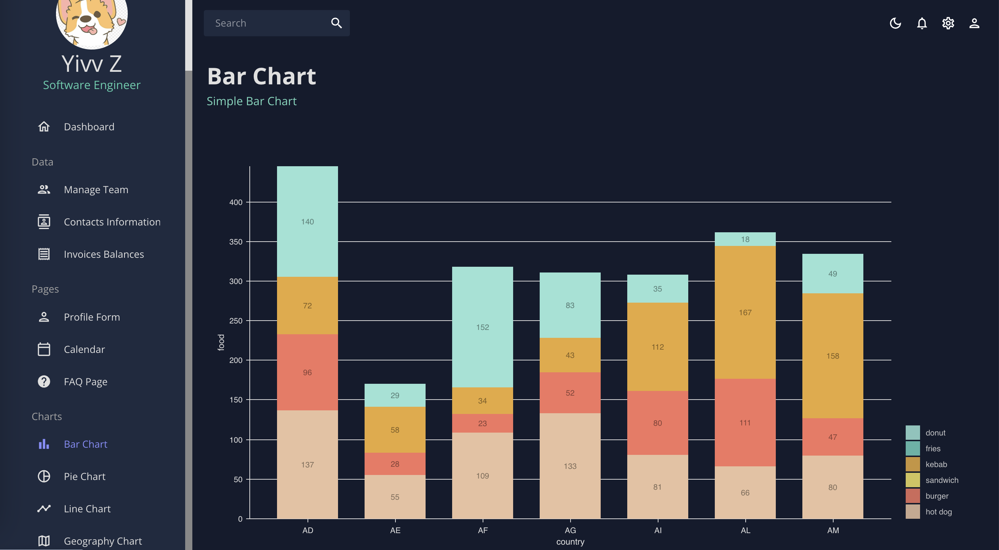

### Pie Chart Page:

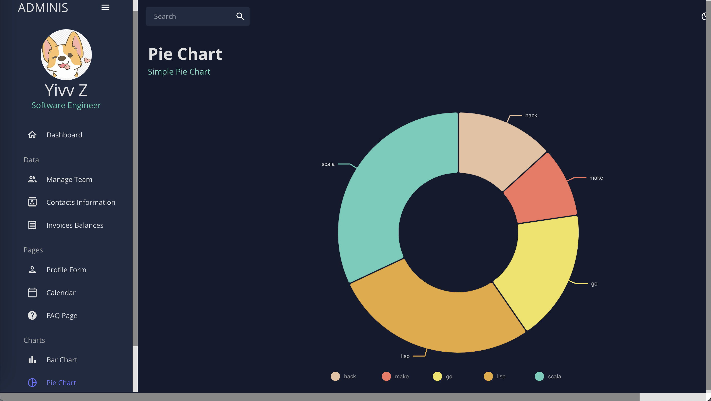

### Line Chart Page:

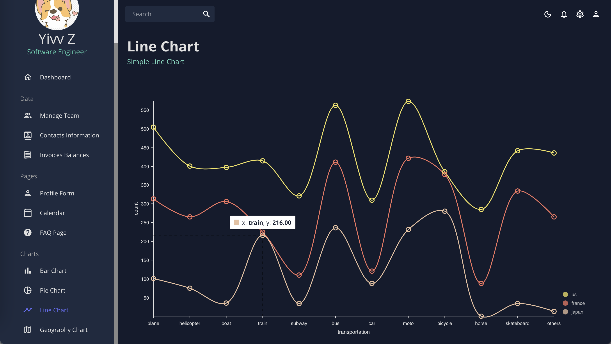

### Geography Chart Page:

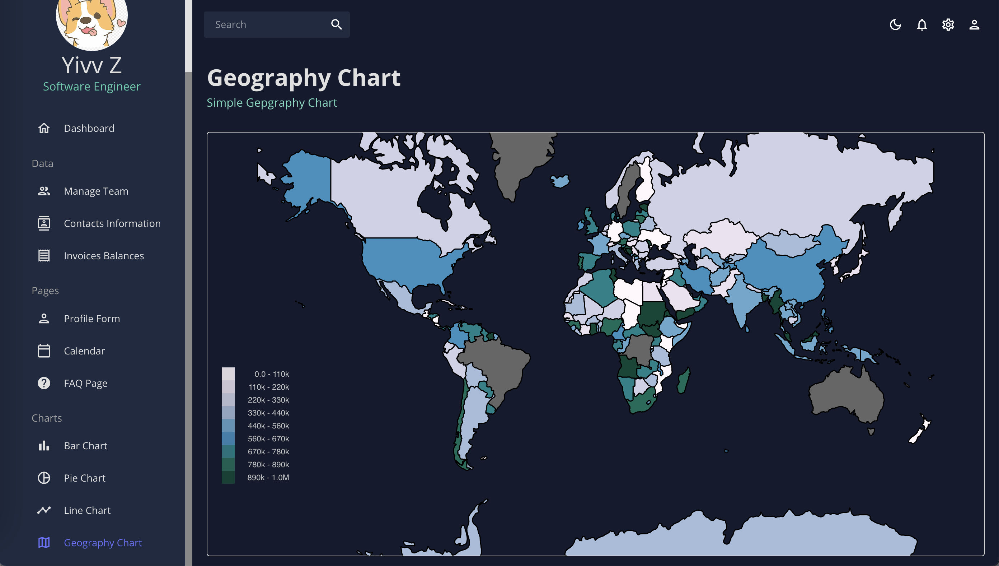
